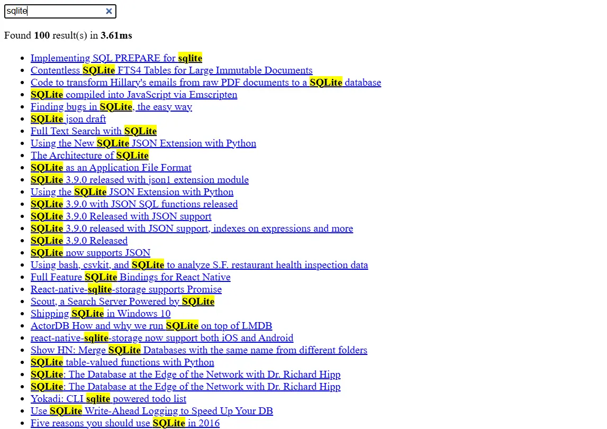

## SQLite Full-text search demo

This demo is created to showcase the full-text search feature in SQLite using the FTS4 module. Learn more about FTS in [this blog](https://frikishaan.com/blog/full-text-search-with-sqlite/).

This demo uses Laravel + [Volt](https://livewire.laravel.com/docs/volt). 

## Setup

Use the following steps to setup the demo in your local environment.

### Clone the repository

Clone the repository using the following command - 

```bash
git clone https://github.com/frikishaan/laravel-sqlite-fts-demo
```

### Install dependencies

Install the PHP and Node dependencies using - 

```bash
composer install
```

```bash
npm install && npm run build
```

### Download data

In this demo I have used the Hackernews dataset, which can be found [here](https://www.kaggle.com/datasets/hacker-news/hacker-news-posts). It has more than 290K records, which is also nice to stress test the functionality.

Put the downloaded csv in the `storage/app/public` folder of your project.

### Run migrations 

Run the laravel migrations - 

```bash
php artisan migrate
```

### Populate the data in database

Use the `load-db` command found in this project to populate the database from the csv content.
Before running the command make sure the `$csv_path` variable in [this file](./app/Console/Commands/PopulateDatabase.php#L26) is set to the path where your csv is located.

```bash
php artisan load-db
```

### Playaround

Run the laravel in-built server using 

```bash
php artisan serve
```

Navigate to the `/search` route.

You should see the search results as seen below - 


